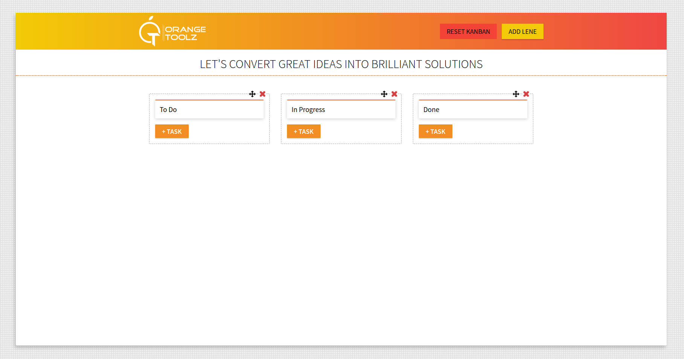

To start the project using docker make sure port 3000 is available on your machine and if you're trying using yarn or npm it's your preference.

```
docker-compose up --build
```

The Project is deployed using netlify and live in this url:
[Orangetoolz Task Manager](https://orangetool.netlify.app/)





Recent Contribution History

